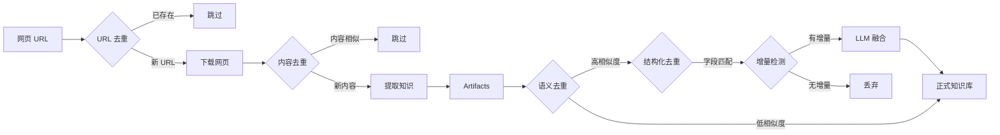

# 知识库去重功能总结

## 1. 概述

本项目实现了**多层次、多维度**的去重机制，覆盖了从网页爬取到知识入库的全流程。去重功能不仅是为了节省存储空间，更重要的是为了**保证知识库的纯净度**，避免 Agent 在检索时被重复、冗余甚至冲突的信息干扰。

---

## 2. 去重架构

整个去重流程分为两个独立但互补的阶段：

1.  **爬取阶段去重 (Web Deduplication)**：防止重复爬取相同的网页。
2.  **入库阶段去重 (Knowledge Refinement)**：防止将相同的知识点重复写入知识库。

---

## 3. 详细去重机制

### 3.1 爬取阶段去重 (Web Scraper Level)

位于 `utils/web_deduplication.py`，确保源头数据的唯一性。

*   **URL 级去重 (URL Deduplication)**
    *   **标准化**：自动将 URL 转为小写，移除默认端口（`:80`, `:443`）。
    *   **参数清洗**：剥离 `utm_source`, `spm`, `timestamp` 等追踪参数，确保同一页面的不同链接变体被识别为同一个。
    *   **持久化**：使用 SQLite 记录已爬取的 URL 哈希。

*   **内容级去重 (Content Deduplication)**
    *   **SimHash 指纹**：计算网页正文的 SimHash 值。
    *   **海明距离**：通过比较 SimHash 的海明距离，识别**内容高度相似**（如转载、微调）的网页。
    *   **阈值控制**：默认相似度阈值 0.85，超过即视为重复。

### 3.2 入库阶段去重 (Refiner Level)

位于 `refiner/` 模块，是知识治理的核心，采用“三层过滤漏斗”设计。

#### 第一层：语义相似度检测 (Semantic Deduplication)
*   **原理**：使用 Embedding 模型（如 `bge-m3` 或 `text-embedding-3-small`）将知识条目向量化。
*   **作用**：快速筛选出**语义上可能重复**的候选集。
*   **阈值**：余弦相似度 > 0.85 视为潜在重复。
*   **优势**：能识别表述不同但含义相同的知识（例如：“数据流图的定义” vs “什么是 DFD”）。

#### 第二层：结构化字段匹配 (Structural Matching)
*   **原理**：针对不同类型的知识（概念、规则、案例），定义特定的**关键标识字段** (Primary Keys)。
*   **匹配逻辑**：
    *   **概念 (Concepts)**：比较 `id` 和 `name`。
    *   **规则 (Rules)**：比较 `rule_id` 和 `name`。
    *   **案例 (Examples)**：比较 `scenarios[].name` 和 `domain`。
*   **作用**：精确判断两份知识是否在描述**同一个具体对象**。

#### 第三层：增量与融合 (Increment Detection & Fusion)
*   **增量检测**：如果两份知识被判定为重复，进一步检查新条目是否包含**新信息**（如新的属性、更详细的描述、新的案例）。
*   **LLM 融合**：
    *   **定义优先**：保留更准确的定义。
    *   **属性并集**：合并双方的属性列表。
    *   **来源溯源**：在合并后的知识中记录所有来源 URL，实现知识溯源。

---

## 4. 总结与优势

| 阶段 | 去重对象 | 核心技术 | 解决问题 |
| :--- | :--- | :--- | :--- |
| **爬取前** | URL | 规则标准化、参数清洗 | 避免重复请求，节省带宽 |
| **爬取后** | 网页内容 | SimHash、海明距离 | 过滤转载文章、SEO 垃圾页 |
| **入库前** | 知识点 | Embedding、字段匹配、LLM 融合 | **解决语义重复、实现知识聚合** |

这套机制保证了我们的知识库不是简单的“堆砌”，而是经过**提炼和整合**的高质量知识网络。
